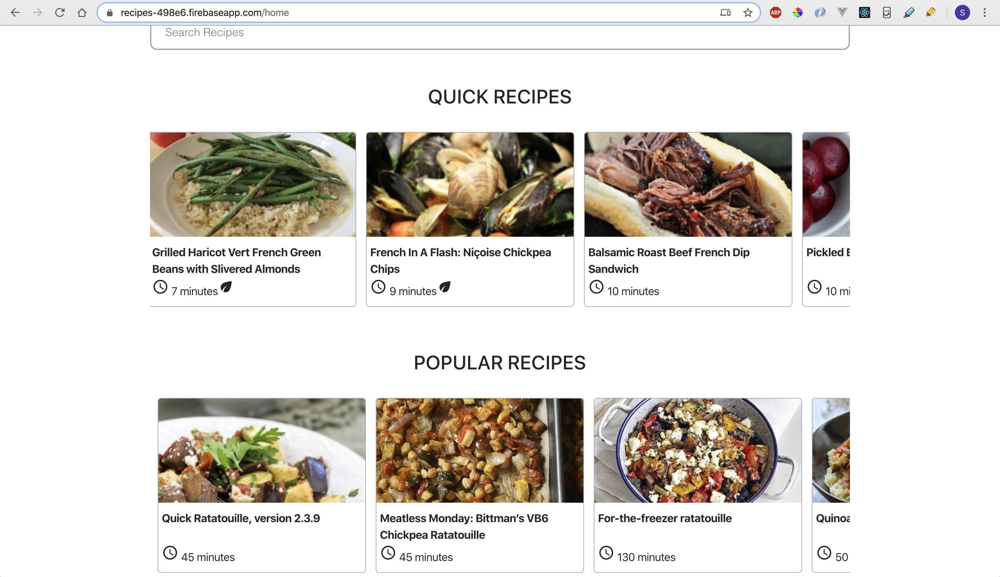
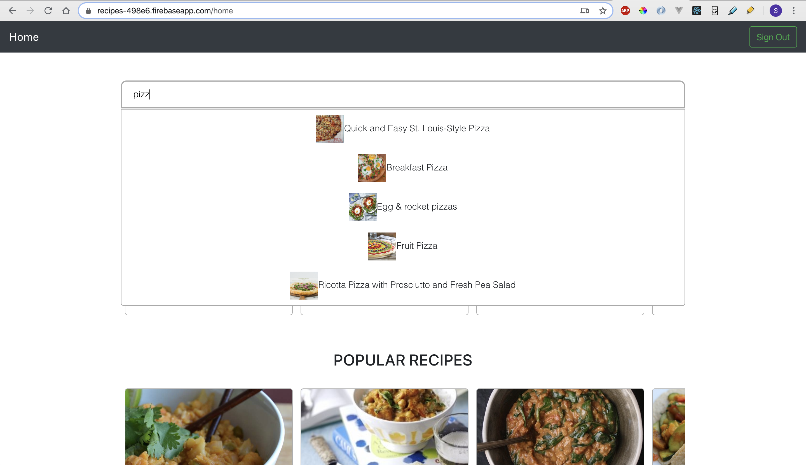
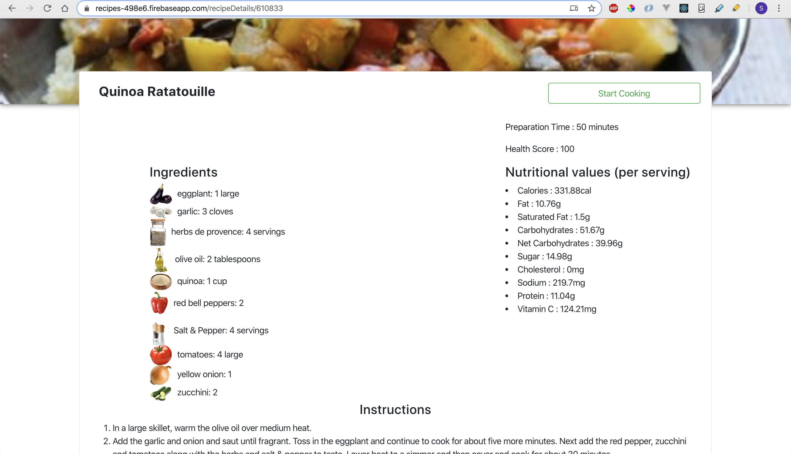
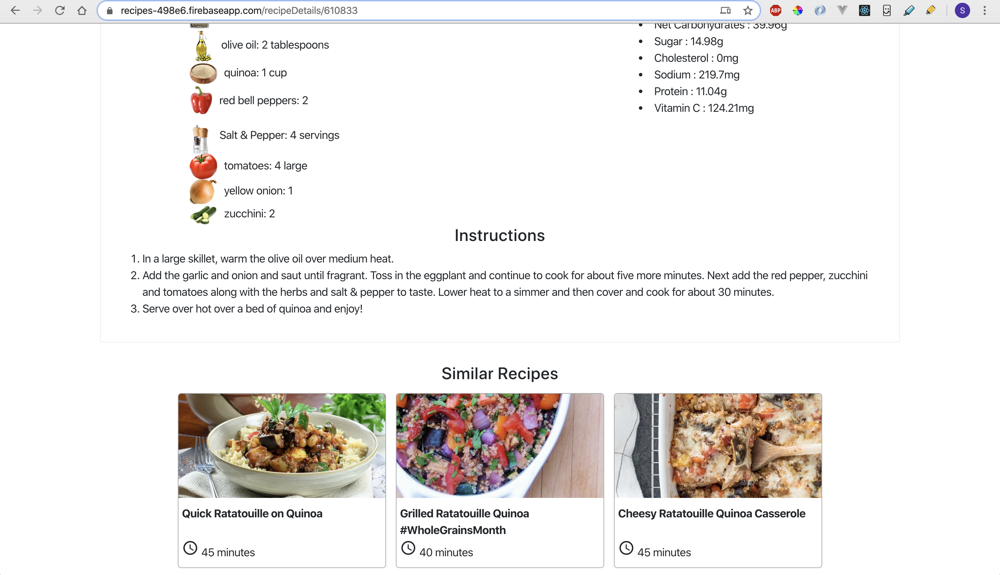

# RECIPES

My love towards cooking triggered me to build this Recipes web application. It displays recipes from different cuisines and suggests recipes to user's choice.

## Features

* User signup & login
* Choice of cuisines selection on user signup
* Recipes displayed according to user's choice of cuisines
* Search any Recipe with different keywords
* Recipe details such as Ingredients, Nutrition values, Preparation process and similar Recipes are suggested.

## Technologies / Tools

* React JS
* Firebase cloud functions
* Firebase cloud firestore database
* Spoonacular API

## Live site

[https://recipes-498e6.firebaseapp.com/](https://recipes-498e6.firebaseapp.com/)

## Backend Repo

[https://github.com/srv-dev/recipes-firebase-server](https://github.com/srv-dev/recipes-firebase-server)

## Known issues

* Cuisine selection in home page is yet to be developed.

## Screenshots

* Recipes Home page

* Search Recipes

* Recipes details

